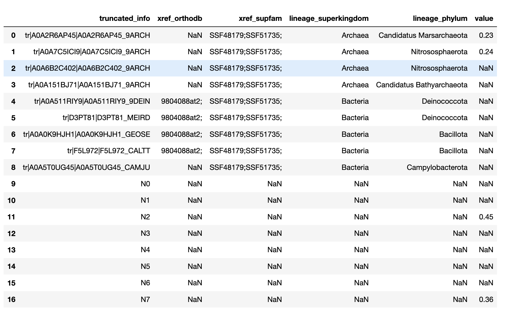
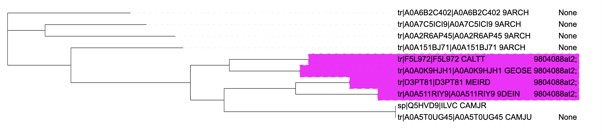
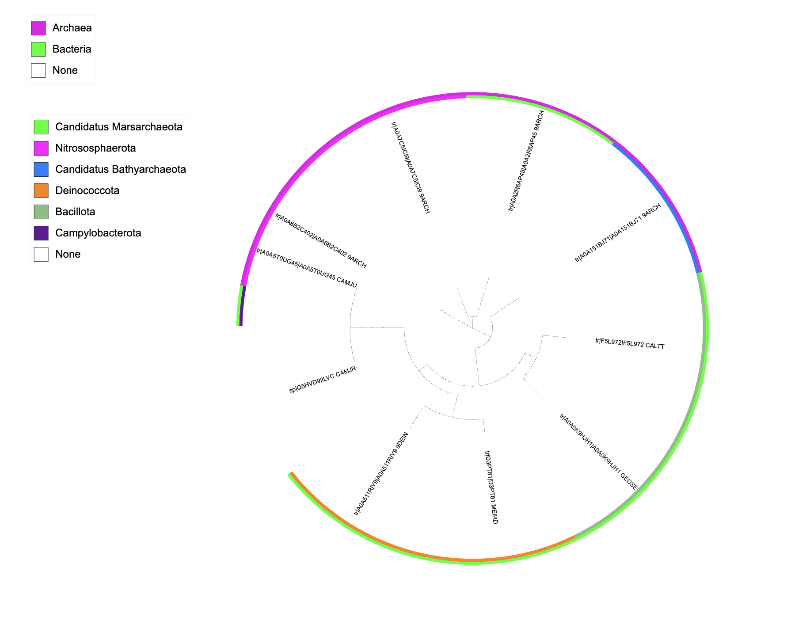
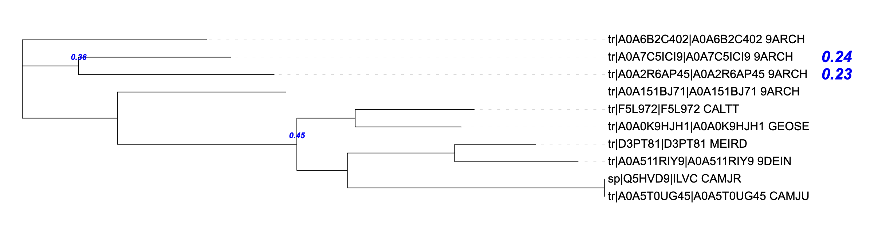
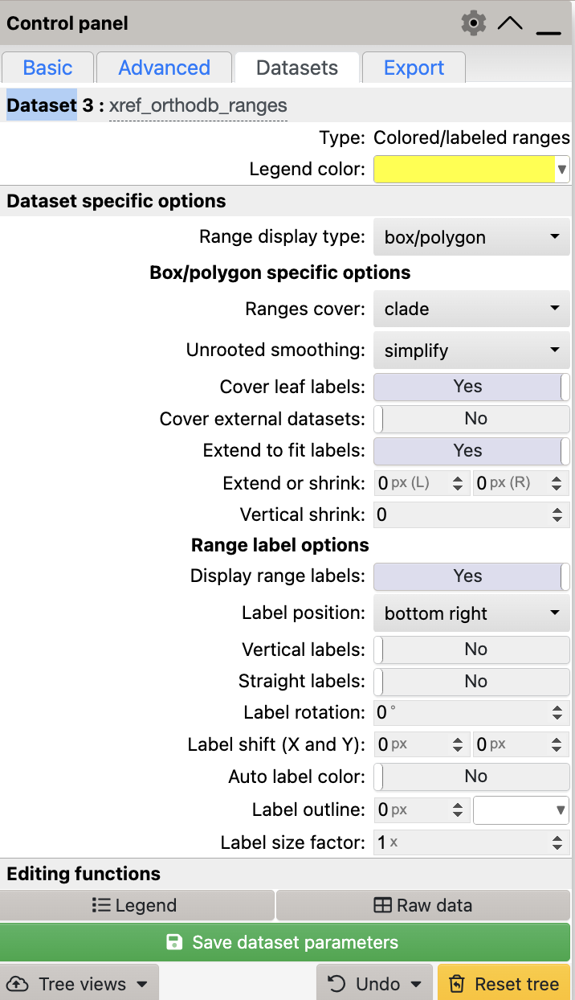

# Generate iTOL annotations

It works on passing a .csv file that looks something like this, i.e. there is a column that matches the labels you have in your nwk file followed by annotations.

Then it just replaces values from this file into the templates defined in itol_text.py.

It will generate a colour_dict automatically, but you can also just define your own colours and pass in a colour_dict (there's a comment in the code where you can override it).

It generates these three styles of annotations:

Colour ranges (from 'xref_orthodb' column)

Colour strips (from lineage_superkingdom, lineage_phylum)

Text on extants / ancestors (from value column)

# Note for ranges

Note that for ranges you need to toggle - 'Cover leaf labels' and 'Extend to fit labels' to view them correctly

